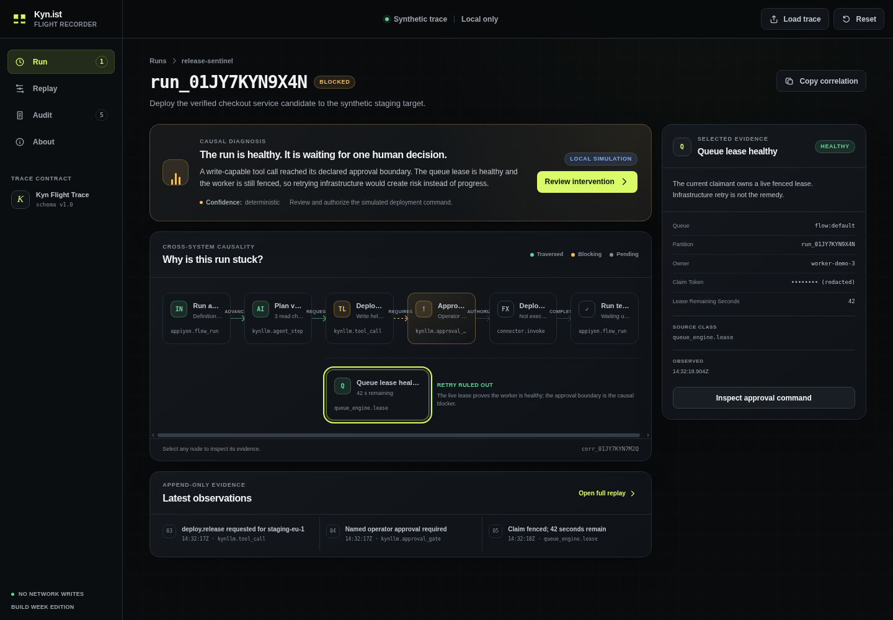

# Kyn.ist Flight Recorder

**See where an autonomous agent run is stuck, prove why, and rehearse the one
controlled move that can advance it.**



Kyn.ist Flight Recorder is a standalone, local-first developer tool built for
OpenAI Build Week 2026. It turns one portable agent trace into a causal graph,
a deterministic replay, and a revision-fenced intervention receipt—without
requiring the Kynist stack, a database, credentials, package installation, or a
build step.

## Judge path: 60 seconds

1. Run `python3 serve.py` and open <http://127.0.0.1:4173/app/>.
2. Read the diagnosis, then select **Queue lease healthy**. This is the evidence
   that an infrastructure retry would be the wrong intervention.
3. Select **Approval required**, then choose **Preview controlled intervention**.
4. Enter a 12+ character reason, acknowledge the local-only scope, and authorize.
5. Inspect the revision `7 → 8` receipt and switch to **Replay** for the append-only
   evidence trail.
6. Choose **Reset demo** to restore the exact signed fixture state.

Nothing in that journey can call a tool, deploy software, or create an external
effect. The transition is a browser-local rehearsal.

## Run it

Requirements: Python 3.10+ and a modern browser.

```bash
python3 serve.py
```

The server prints the local URL. It exposes only the static application,
`/healthz`, and the local fixture; directory listing and write methods are
disabled.

| Platform | Runtime path | Tested in this cut |
| --- | --- | --- |
| Linux | Python 3.10+; Chrome/Chromium, Firefox, or Edge | Python 3.13 + Chromium 147 |
| macOS | Python 3.10+; Safari, Chrome, or Firefox | Contract-compatible; not physically tested |
| Windows | Python 3.10+; Edge, Chrome, or Firefox | Contract-compatible; not physically tested |

There is no install, compilation, migration, account, secret, or network service.
The bundled sample trace loads automatically. A judge can test the complete
project from a clean clone without rebuilding anything.

## What the trace proves

The sample run has reached a write-capable deployment request. The effect has not
executed because policy requires a named operator decision. At the same time, a
healthy fenced queue lease proves that restarting infrastructure is not the
remedy. The deterministic diagnosis joins those facts across agent, tool,
approval, queue, effect, and terminal evidence.

The legal intervention is deliberately narrow:

- it is available only from `blocked`;
- it must match run revision `7` and the pinned actor;
- preview is side-effect free;
- authorization requires a bounded reason and local-simulation acknowledgement;
- apply advances exactly one revision and appends a receipt;
- duplicate apply returns the same receipt;
- `completed` is absorbing until explicit demo reset.

You can also import a local JSON trace up to 1 MiB. Invalid schema versions,
dangling edges, correlation mismatches, event gaps, unsafe effect claims, and
broken command fences fail closed. Imported content remains in browser memory.
See the [v1 trace contract](docs/trace-contract.md).

## Architecture and trust boundary

| Layer | Responsibility | Dependency |
| --- | --- | --- |
| `serve.py` | Read-only static serving, health, CSP and security headers | Python standard library |
| `app/core.mjs` | Trace validation, redaction, deterministic state machine | Browser platform |
| `app/app.mjs` | Accessible rendering, import, focus, reset, session receipt | Browser platform |
| `app/data/demo-run.json` | Versioned synthetic sample and legal transition | Repository fixture |
| `scripts/gpt56_review.py` | Optional submission-time adversarial evidence review | Python stdlib + explicit OpenAI API call |

There is one UI entry, one fixture, one graph model, and one mutation path. All
dynamic values enter the DOM through text nodes. Sensitive-key redaction happens
before state reaches rendering. Session storage can retain only the fixture-bound
command receipt so a reload demonstrates idempotency; **Reset demo** deletes it.

The full security assumptions and residual risks are in the
[threat model](docs/threat-model.md), and the data lifecycle is in
[PRIVACY.md](PRIVACY.md).

## OpenAI Build Week: Codex and GPT-5.6

### Codex

The majority of the project was built in one Codex session from an empty,
standalone repository. Codex was used to:

- inspect the source system and freeze a truthful standalone boundary;
- design and implement the causal trace contract and intervention state machine;
- build the responsive, keyboard-complete UI;
- adversarially test contract, security, error, accessibility, and browser paths;
- generate reproducible evidence and submission material;
- keep a forward-only commit chronology.

| Commit | Build Week increment |
| --- | --- |
| `84e6c53` | Standalone repository and product contract |
| `5ddd48a` | Causal flight recorder and guarded intervention |
| `0065258` | Browser, accessibility, and intervention proof |
| `94c1261` | Bounded GPT-5.6 evidence-review path |

The final Devpost entry must include the Codex Session ID returned by `/feedback`
for this project thread.

### GPT-5.6

GPT-5.6 has a bounded review role, not authority over runtime state. The optional
evidence runner sends an allow-listed subset of the synthetic trace to the
Responses API and asks GPT-5.6 to challenge whether the deterministic diagnosis
is actually supported. Structured Outputs constrain the result; the response can
suggest copy but cannot authorize or mutate the demo.

```bash
python3 scripts/gpt56_review.py --dry-run

# After setting OPENAI_API_KEY in your environment:
python3 scripts/gpt56_review.py
```

The runner uses `model: gpt-5.6`, low reasoning effort, `store: false`, and one
bounded request. It persists only a sanitized result, response identifier, token
counts, and hashes—not the key or raw payloads. Its contract follows OpenAI's
[GPT-5.6 model documentation](https://developers.openai.com/api/docs/models/gpt-5.6-sol)
and [Structured Outputs guide](https://developers.openai.com/api/docs/guides/structured-outputs).

**Current evidence status:** the runner and seven negative/contract tests are
complete, but the actual API call is not yet recorded because this environment
has no `OPENAI_API_KEY`. This is an explicit submission blocker, tracked in
[`evidence/gpt-5.6-review.pending.md`](evidence/gpt-5.6-review.pending.md); the
project does not pretend that a model name in sample data is proof of use.

## Verification

Run every dependency-free server, security, schema, and state-machine test:

```bash
python3 scripts/verify.py
```

Run the real-browser journey if Node 20+ and Chromium are installed:

```bash
node scripts/browser_verify.mjs
```

Current reproducible evidence:

- 25 Python contract/server/static assertions;
- 22 JavaScript state-machine assertions;
- 30/30 Chromium journey checks at desktop and 390 px mobile;
- zero axe-core violations in blocked, dialog, receipt, and mobile states;
- first meaningful render measured at 459.7 ms on the reference environment;
- no unexpected network request, console error, external effect, or secret in the
  tested browser journey.

See [evidence/README.md](evidence/README.md) and the
[quality-gate matrix](docs/quality-gates.md). A physical screen-reader pass was
not available and is named as a residual verification gap rather than counted as
proof.

## Deliberate limits

This Build Week cut is a hermetic developer-tool demo, not the entire Kynist
production stack. It does not connect to live agents, execute real tools, provide
multi-tenant authentication, replace production telemetry, or prove that an
arbitrary imported trace is truthful. It proves that a declared trace can be
validated, explained, replayed, and advanced under explicit local invariants.

## Repository map

```text
app/          static application, pure state machine, synthetic fixture
docs/         product, trace, threat, and quality contracts
evidence/     reproducible reports and browser screenshots
schema/       machine-readable v1 structural envelope
scripts/      server/test runners and bounded GPT-5.6 review
submission/   paste-ready Devpost copy, video script, final checklist
tests/        dependency-free positive, negative, and boundary tests
```

## Provenance and license

This repository and its core functionality are new work created during OpenAI
Build Week 2026. The forward-only Git history is the timestamped chronology.
Event references: [Build Week](https://openai.com/build-week/),
[Devpost](https://openai.devpost.com/), and
[official rules](https://openai.devpost.com/rules).

MIT — see [LICENSE](LICENSE).
