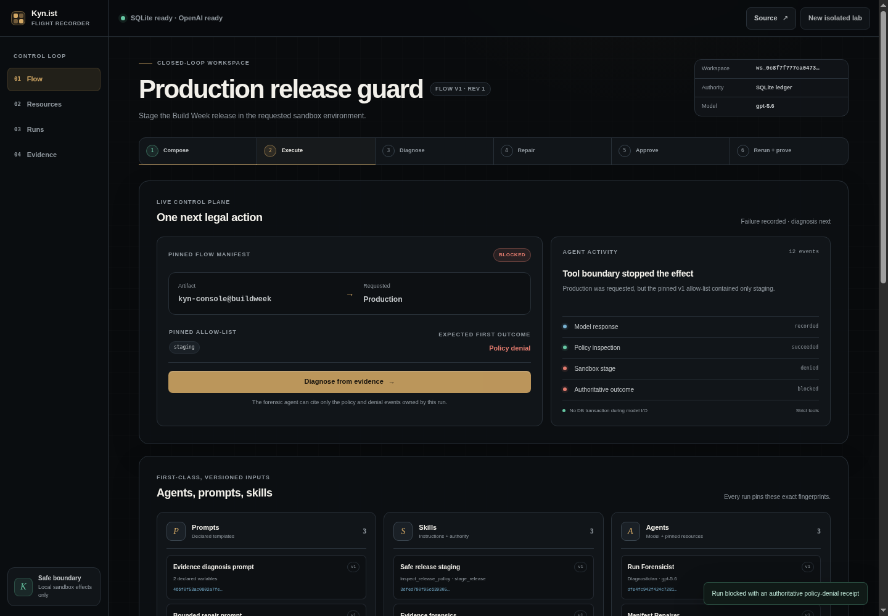

# Kyn.ist Flight Recorder

**A real closed-loop agent runtime that turns a recorded failure into a bounded,
human-approved repair—and proves the changed outcome with a linked rerun.**



**[Open the live project](https://buildweek.kyn.ist/app/)** ·
**[Inspect the source](https://github.com/cakbudak/kyn-flight-recorder)**

Kyn.ist Flight Recorder is a standalone OpenAI Build Week 2026 cut of Kyn's
agent control loop. It composes versioned agents, prompts, skills, and flows;
executes real OpenAI Responses function calls; records authoritative evidence;
diagnoses a causal fault; proposes one bounded repair; requires human approval;
and reruns against a new immutable flow version.

This is not a JavaScript simulation. The HTTP API, orchestration, tool dispatch,
SQLite ledger, diagnosis validation, repair fence, and sandbox effect are real.

## Three-minute judge path

1. Open <https://buildweek.kyn.ist/app/> and choose **Create live agent lab**.
2. Inspect the three versioned **Agents**, **Prompts**, and **Skills** pinned by flow v1.
3. Choose **Run real agent flow**. The executor uses OpenAI and two strict local tools.
4. Inspect the blocked run: production was requested, but the pinned policy permits staging.
5. Choose **Diagnose from evidence**. The forensic agent must cite exactly the two owned
   policy/denial events accepted by code.
6. Choose **Propose bounded repair**. The repair agent may replace only
   `/policy/allowed_environments` and cannot apply its proposal.
7. Open the human fence, inspect proposal hash and expected revision, acknowledge the safe
   sandbox effect, then approve.
8. Choose **Rerun against flow v2**. The linked child run completes and creates exactly one
   durable `sandbox_releases` row.
9. Compare v1/v2 and switch between both hash-linked event ledgers.

The public tool never deploys software. Its only write-capable operation creates a row in a
local sandbox table. That effect is real, durable, idempotent, and deliberately harmless.

## Run locally

Requirements: Python 3.11+, a modern browser, and an OpenAI API key.

```bash
cp .env.example .env
# Add OPENAI_API_KEY to the ignored .env file.
python3 serve.py
```

Open <http://127.0.0.1:4173/app/>. There is no package install, build step, framework, or
external database. Without a key the UI still loads and reports the missing model transport,
but model actions terminate as failed rather than pretending to run.

Optional environment variables:

| Variable | Default | Purpose |
| --- | --- | --- |
| `OPENAI_API_KEY` | none | server-side Responses API credential |
| `OPENAI_MODEL` | `gpt-5.6` | allow-listed model used by seeded agent versions |
| `KYN_DATABASE_PATH` | `var/kyn-flight-recorder.sqlite3` | SQLite database path |
| `KYN_WORKSPACE_MODEL_CALL_LIMIT` | `12` | maximum recorded model calls per workspace |

## What is actually agentic

The seeded flow pins three distinct agent versions:

| Agent | Prompt | Skill | Authority |
| --- | --- | --- | --- |
| Release Sentinel | execution prompt | policy-aware release | `inspect_release_policy`, `stage_release` |
| Run Forensicist | diagnosis prompt | evidence forensics | no tools; structured diagnosis only |
| Manifest Repairer | repair prompt | bounded manifest repair | no tools; one structured proposal only |

Prompts are immutable templates with declared variables. Skills combine instructions with a
tool allow-list. Agent versions pin model, instructions, one prompt version, and skill
versions. Flow versions pin all three agents plus request, policy, and repair bounds. Every
run records those exact version ids and fingerprints before external I/O.

OpenAI is model transport, not authority. Kyn owns the state machine, handoffs, strict tool
validation, effects, evidence, diagnosis acceptance, repair validation, approval, and rerun.
Model prose cannot create a tool effect or approve a repair.

## Closed-loop contract

```text
compose → execute → record → diagnose → propose → human approve → rerun → prove
             │          │                    │                    │
        strict tools   owned evidence   hash + revision fence   linked child
```

The first run intentionally requests `production` under a `staging`-only policy. The tool
denial is authoritative and produces no effect. Code derives a deterministic diagnosis
candidate from the successful policy inspection and denied stage receipt. The diagnostician
may explain that candidate, but its structured output is rejected unless the class, path, and
complete evidence-id set match.

The repairer gets the accepted diagnosis and a bounded manifest. Code accepts exactly one
`replace` operation on the pinned allow-listed path and verifies the value preserves staging
while adding only the requested environment. Application requires the proposal hash, current
flow revision, human actor, reason, and acknowledgement in one SQLite compare-and-swap.

The old flow version and failed run are never edited. The rerun is a new child run against
flow v2; success is proven by its tool receipt and one corresponding sandbox-effect row.

## Flat SQLite—not Kyn's internal ontology

This standalone database is an explicit tabular product projection. It does **not** reproduce
Parts, Entities, Bricks, Frames, graph nodes/edges, or the production Kynist schema.

```text
workspaces
prompts → prompt_versions
skills → skill_versions
agents → agent_versions
flows → flow_versions
runs → events | model_calls | tool_receipts | diagnoses → repairs → repair_approvals
                                                        └→ sandbox_releases (child run)
```

Version rows and events are database-immutable. Terminal run states are absorbing. Events
form a per-run SHA-256 chain. SQLite WAL and short `BEGIN IMMEDIATE` transactions serialize
mutations; no transaction remains open during OpenAI I/O.

See the [runtime design](docs/runtime-design.md), [ledger contract](docs/trace-contract.md),
[threat model](docs/threat-model.md), and [privacy lifecycle](PRIVACY.md).

## API and trust boundary

`serve.py` is the composition root and serves both the application and `/api/v1` on one
origin. `backend.service.ControlPlane` is the only product mutation path.

Public workspaces use an opaque, hashed, 24-hour token in an `HttpOnly`, `SameSite=Strict`,
`Secure`-on-HTTPS cookie. Mutations require a matching origin. Request size, tool turns,
workspace model calls, address/global model calls, and concurrent model actions are bounded.
The API key remains server-side and is never written to SQLite, logs, events, or responses.

The static tool registry exposes only two schemas. A skill stored in SQLite can grant a known
tool to an agent but can never register code, shell access, filesystem access, arbitrary
network access, MCP access, or a production connector.

## Verification and evidence

Run all backend, HTTP, database-invariant, resource, server, and UI contract tests:

```bash
python3 scripts/verify.py
```

Run the complete UI journey in a real local Chromium process against the real HTTP/SQLite
stack and deterministic provider-shaped responses:

```bash
node scripts/browser_verify.mjs \
  --report evidence/browser/closed-loop-report.json \
  --artifacts evidence/browser
```

Run the identical browser journey against a configured deployment (this invokes OpenAI):

```bash
node scripts/browser_verify.mjs \
  --base-url https://buildweek.kyn.ist \
  --report evidence/live/closed-loop-report.json \
  --artifacts evidence/live
```

Current committed proof:

- 43 Python tests across positive, negative, boundary, isolation, concurrency, revision, and database
  invariants;
- 6 pure browser-state contract tests;
- 21/21 real Chromium checks across desktop and 390 px mobile;
- 21/21 of the same checks completed against real `gpt-5.6` Responses calls;
- 21/21 again through the public HTTPS proxy/service deployment;
- a blocked v1 run with zero effects and completed linked v2 run with one effect;
- owned diagnosis citations, human approval, two valid event chains, no browser console error,
  no failed browser request, and no cross-origin browser runtime request.

The real-model and public reports are in [`evidence/real-model/`](evidence/real-model/) and
[`evidence/live/`](evidence/live/). They retain safe ids, hashes, statuses, and UI state—not
keys, cookies, prompts, raw provider bodies, or hidden reasoning.

## Codex provenance

Codex built and reviewed the majority of this project in one forward-only Build Week thread:
`019f7621-5200-7400-9242-920cb718d09a`.

The immutable Git history shows the transition from the rejected static cut to the real
runtime:

| Commit | Increment |
| --- | --- |
| `f1ae8b8` | real closed-loop product and runtime contract |
| `abc6f2e` | deliberately RED runtime tests |
| `9f01775` | authoritative flat SQLite agent runtime |
| `287de1f` | deliberately RED HTTP isolation tests |
| `d838434` | same-origin runtime API |
| `88612fb` | real-loop UI with Agents, Prompts, and Skills |
| `2e664a3` | full Chromium closed-loop proof |
| `502836e` | sanitized real gpt-5.6 browser proof |
| `02be363` | concurrent-workspace execution fence |
| `c0433dc` | persistent bridge-bound deployment service |
| `2523c91` | public HTTPS gpt-5.6 closed-loop proof |

## Honest limits

This is not the complete Kynist production stack and does not claim universal framework
superiority. It does not expose arbitrary user tools, production deployment authority,
durable multi-tenant identity, the production queue/MCP/connectors, or Kyn's internal data
model. It demonstrates one narrower differentiator end to end: authoritative execution
evidence, evidence-bound diagnosis, bounded repair, revision-fenced human authority, and a
linked rerun that proves the outcome changed.

## Repository map

```text
app/          dependency-free browser control plane
backend/      resources, runtime, tools, SQLite store, and HTTP API
deploy/       nginx reverse proxy plus system/user service contracts
docs/         product, runtime, ledger, threat, and quality contracts
evidence/     sanitized deterministic and real-model browser proof
scripts/      verification runners
submission/   paste-ready Build Week submission material
tests/        runtime, HTTP, database, security, and UI contracts
serve.py      single composition root
```

MIT — see [LICENSE](LICENSE).
